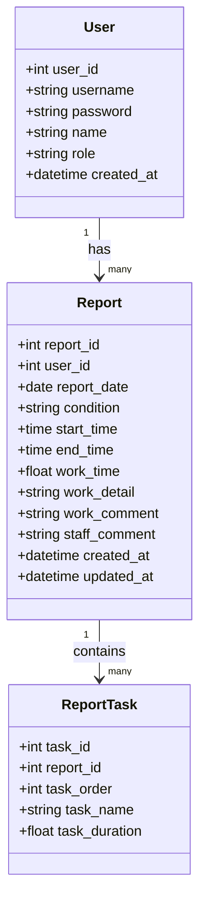

```mermaid
classDiagram
    class User {
        +int user_id
        +string username
        +string password
        +string name
        +string role
        +datetime created_at
    }

    class Report {
        +int report_id
        +int user_id
        +date report_date
        +string condition
        +time start_time
        +time end_time
        +float work_time
        +string work_detail
        +string work_comment
        +string staff_comment
        +datetime created_at
        +datetime updated_at
    }

    class ReportTask {
        +int task_id
        +int report_id
        +int task_order
        +string task_name
        +float task_duration
    }

    User "1" --> "many" Report : has
    Report "1" --> "many" ReportTask : contains
```