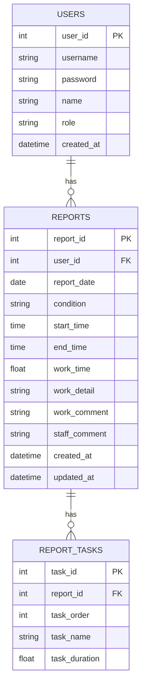

```mermaid
erDiagram
    USERS {
        int user_id PK
        string username
        string password
        string name
        string role
        datetime created_at
    }

    REPORTS {
        int report_id PK
        int user_id FK
        date report_date
        string condition
        time start_time
        time end_time
        float work_time
        string work_detail
        string work_comment
        string staff_comment
        datetime created_at
        datetime updated_at
    }

    REPORT_TASKS {
        int task_id PK
        int report_id FK
        int task_order
        string task_name
        float task_duration
    }

    USERS ||--o{ REPORTS : "has"
    REPORTS ||--o{ REPORT_TASKS : "has"
```