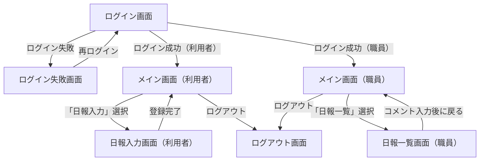

```mermaid
graph TD
    Start[ログイン画面]
    LoginError[ログイン失敗画面]
    MainUser[メイン画面（利用者）]
    MainStaff[メイン画面（職員）]
    InputReport[日報入力画面（利用者）]
    ReportList[日報一覧画面（職員）]
    Logout[ログアウト画面]

    Start -->|ログイン成功（利用者）| MainUser
    Start -->|ログイン成功（職員）| MainStaff
    Start -->|ログイン失敗| LoginError
    LoginError -->|再ログイン| Start

    MainUser -->|「日報入力」選択| InputReport
    InputReport -->|登録完了| MainUser
    MainUser -->|ログアウト| Logout

    MainStaff -->|「日報一覧」選択| ReportList
    ReportList -->|コメント入力後に戻る| MainStaff
    MainStaff -->|ログアウト| Logout
```